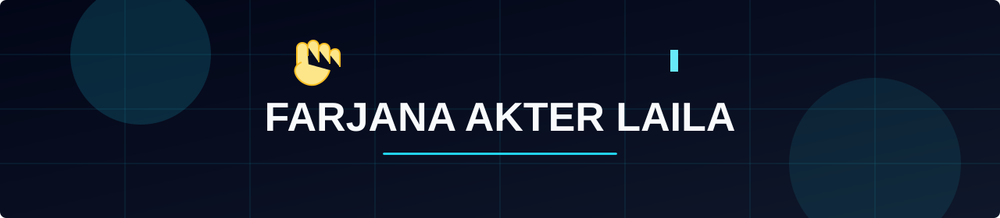

  

 

<h2 align="center">?? Welcome to my creative space! ??</h2>

  <i>? Building clean, fast, and friendly web experiences with care ?? ?</i>

<h3 align="center">
  
</h3>

  
  
  

### ????? A little about me...

I'm a **Mid-level Developer** who enjoys turning ideas into simple, useful, and visually polished websites.

- ?? Currently working as a Mid-level Developer at **[XIIA](https://www.linkedin.com/company/xiia)**
- ?? Building web apps with **React, JavaScript & Tailwind**
- ?? Care about clean UI, smooth animation, and a good user feel
- ?? Comfortable on the backend too: **Node.js, Express, Firebase & MongoDB**
- ?? Always learning new tools and shipping better work
- ?? Based in **Denmark**

 
 

---

### ?? What I do

- ? Turn designs into responsive, production-ready web pages
- ?? Build UI with **HTML, CSS, Tailwind, Bootstrap & React**
- ?? Connect apps to **REST APIs, Express & Firebase**
- ??? Work with **MongoDB** and modern JS workflows
- ?? Keep growing as a developer ù one project at a time

---

### ?? Tech Stack

  
  
  
  
  
  
  
  
  
  
  
  

---

### ?? Connect with me

  
  
  
  

